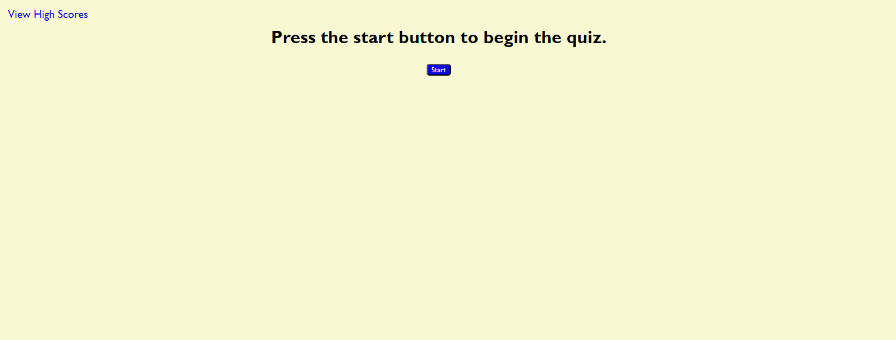

# Javascript-quiz

## Description
This is my History of Philadelphia quiz, built using javascript. On first opening the site, the user has the options of beginning a quiz or viewing the locally stored high scores. When the quiz begins, a timer starts counting down from one minute. For each incorrect answer, the timer decreases by 20. For each correct answer, the user's score increases by 10. Upon answering all questions or running out of time, the user is shown their score and asked to enter their name. Upon submitting their name, they are taken to the high scores page, which displays all locally stored scores in descending order. The overwhelming majority of this project was made exclusively with javascript, with only a few html elements containing text and some light css styling. 

[This is a link to the deployed site.](https://danmac121.github.io/Javascript-quiz/)

